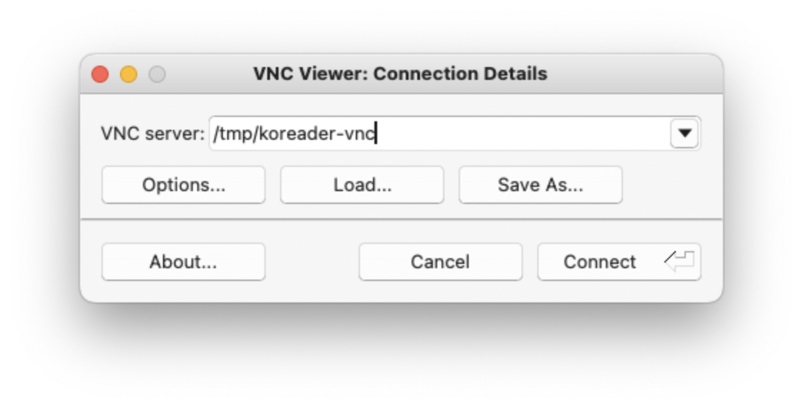
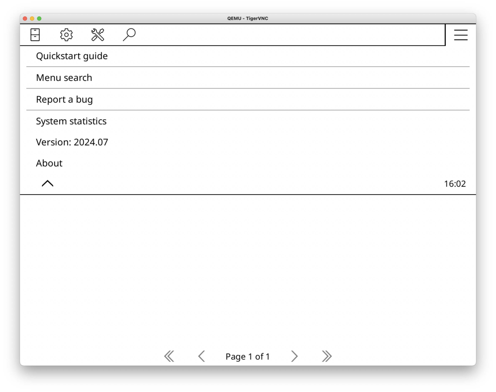

# koreader-vagrant

This `Vagrant` file creates a `qemu` Virtual Machine and installs [KOReader](https://github.com/koreader/koreader) in it.

The main purpose is to have a KOReader working on MacOS without the necessity to build the source code.

Vagrant is used to download a Fedora Cloud Image and to configure it to automatically install KOReader and a Systemd Service File to start KOReader when the machine is started.

This setup assumes that there is folder `Bibliothek` present in the Users Home Directory, which will be mounted in the Machine.
KOReader reads documents from it **and** stores its configuration there.

Has been tested on x86_64 MacOS 15.0.1 (Sequoia).

## Dependencies

- `qemu` (`brew install qemu`)
- `vagrant` (`brew install vagrant`)
- `vagrant-qemu` (`vagrant plugin install vagrant-qemu`)
- `tigervnc-viewer`(`brew install tigervnc-viewer`)

## Usage

Install Dependencies, clone Repository and execute:

`vagrant up`.

After Provisioning you should be able to connect to `/tmp/koreader-vnc` VNC socket via your favorite VNC viewer.

## Screenshots

- 
- 
- 
